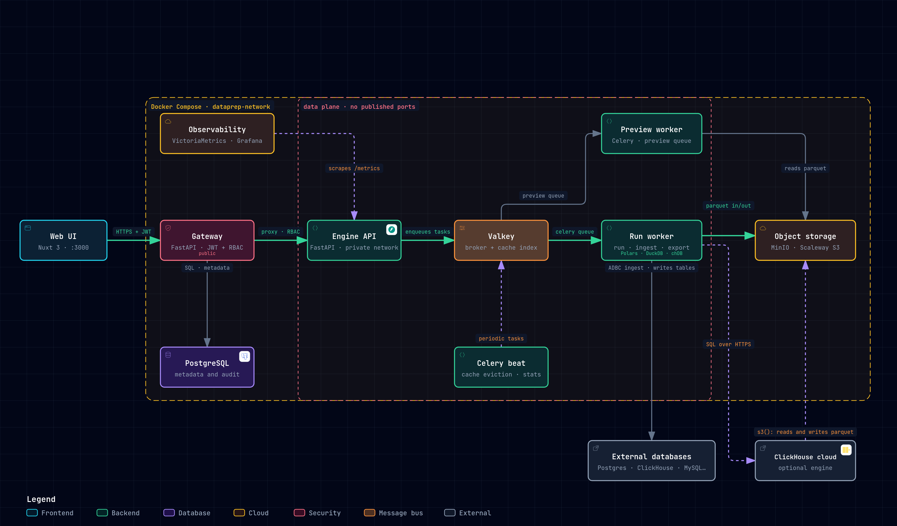

# Tabularia

**Self-hosted, open-source visual data-preparation platform** — a Tableau Prep–style
flow editor on pluggable streaming engines, with full-data previews, loops, charts,
database sources & destinations, scheduling, cross-flow lineage, and an audit trail.
No sampling.

> *Tabularia takes its name from the Tabularium, the records office of ancient Rome —
> the place where the state's tables were kept in order.*

---

# Part I · Business

## The problem

Visual data-prep tools either cost thousands per seat, or quietly work on **samples**
of your data and hope for the best. Teams end up choosing between price, honesty about
scale, and the freedom to run the tool on their own infrastructure.

Tabularia is an open-source alternative you host yourself: a visual, drag-and-drop
data pipeline builder that runs on the **entire** dataset, connects straight to your
databases, and keeps a full record of who did what.

## What you get

- **Build pipelines visually — no code.** Drag transformations onto a canvas, connect
  them, and preview the result at any step. Familiar to anyone who has used Tableau
  Prep, Alteryx, or Knime.
- **No sampling, ever.** Previews, profiles, and charts run on the *whole* dataset
  through a streaming engine — what you see in the editor is what you ship.
- **Connect to your databases.** Read directly from Postgres, MySQL, SQL Server,
  ClickHouse and more; write results back to a database table or publish them as a
  reusable datasource. Files (CSV/Excel/JSON/parquet) work too.
- **Schedule and forget.** Put flows on a schedule (timezone-aware, DST-safe) and let
  them refresh on their own; a load heatmap shows busy time-bands and collisions
  before they bite.
- **Full history & governance.** Every run is recorded with downloadable results; an
  **audit log** captures logins, flow runs, data exports, and permission changes —
  "who entered, who ran what, which data was downloaded" — with a 24-hour access chart.
- **See how everything connects.** A dedicated **Lineage** view maps datasources and
  flows across the whole workspace: provenance, impact/blast-radius, staleness, and
  broken references at a glance.
- **Multi-user from day one.** JWT login, users & groups, nested projects with
  inherited view / edit / manage / connect permissions. Everyone works in the same
  place, safely.
- **Yours to run.** Self-hosted, AGPL-3.0 open source, no per-seat fees, no data
  leaving your infrastructure. Point it at managed S3 / Postgres / Redis if you prefer.
- **Speaks your language, looks the part.** UI available in **English, Italian,
  French, German, Spanish**, with **Dark, Light, Dracula, and Monokai** themes,
  selectable per user.

## Who it's for

Data & analytics teams that want a self-hosted, governed, no-sampling data-prep tool
without enterprise licensing — and anyone who needs an auditable, multi-user pipeline
builder on top of their existing databases and object storage.

---

# Part II · Technical

## Architecture

[](https://jumpasaservice.github.io/Tabularia/architecture/runtime-architecture.html)

**[Open the interactive diagram](https://jumpasaservice.github.io/Tabularia/architecture/runtime-architecture.html)**
(pan/zoom, light/dark theme, search, guided views, PNG/SVG export). It is generated
with [Archify](https://github.com/tt-a1i/archify) from
[`docs/architecture/runtime.architecture.json`](docs/architecture/runtime.architecture.json);
every node cites the source files that implement it, verified against the commit
pinned in the spec.

| Runtime component | Role |
|---|---|
| Web UI | Nuxt 3 app, calls the gateway only (JWT) |
| Gateway | FastAPI control plane: auth, RBAC, audit, in-process scheduler; proxies to the engine after the permission check |
| PostgreSQL | control-plane metadata (users, groups, projects, versioned flows, connections, runs, schedules, audit) |
| Engine API | FastAPI on the private network: turns every preview and run into a Celery task |
| Valkey | Celery broker and step-cache index |
| Run worker / preview worker | Celery workers on two queues (`celery`: runs, DB ingest, export · `preview`: interactive previews); engines in-process (Polars, DuckDB, chDB) |
| Celery beat | cache eviction and storage statistics |
| Object storage | one bucket, all parquet: `datasets/` snapshots, `cache/` steps, `out/` results (MinIO locally, any S3 such as Scaleway in the cloud) |
| ClickHouse cloud | optional remote engine, reads and writes the parquet directly through `s3()` |
| External databases | sources ingested via ADBC into parquet snapshots; Output nodes can write tables back |
| VictoriaMetrics + Grafana | scrape the engine `/metrics`, celery-exporter, cAdvisor and node-exporter |

The **gateway** (control plane) is the only public ingress: it owns the metadata
Postgres and enforces auth + RBAC on every call before proxying to the internal
**engine** (data plane), which stays stateless (Valkey + S3 only).

## Declarative IR & pluggable engines

Flows are stored as a **declarative IR** — a JSON list of typed operations — fully
decoupled from execution. Adding or swapping an engine touches neither the routes, the
workers, nor saved flows. Four engines are registered:

| Engine | id | Notes |
|---|---|---|
| **Polars** | `polars` | In-process, lazy, streaming. **Default**; full operation coverage. |
| **DuckDB** | `duckdb` | Out-of-core SQL (spills to disk) for very large joins/aggregations. Full operation coverage. |
| **chDB (ClickHouse)** | `chdb` | Out-of-core SQL with the ClickHouse dialect. Full coverage except `foreach`. |
| **ClickHouse (external)** | `clickhouse` | *Optional.* Same dialect and ops as chDB, executed on a **remote ClickHouse server** (cloud managed, e.g. Scaleway, or self-hosted). Enabled by `CLICKHOUSE_EXTERNAL__HOST`. Transport `s3` (the server reads/writes parquet directly on the object storage, nothing through the worker) or `push` (staging table + streamed result, works with any server). |

Engines agree on SQL semantics for most behaviour — nulls, aggregates, sort order, casts
and joins are guaranteed identical and enforced by an oracle suite — but not on
everything. **[docs/engines/engine-differences.md](docs/engines/engine-differences.md)**
is the contract: what is guaranteed, what differs, and the rules of thumb. Read it before
setting a production engine different from the development one.

Each engine is a registry of per-operation implementations. DuckDB and chDB are
guarded imports — absent packages simply mark the engine unavailable without breaking
Polars; the external ClickHouse engine is listed but unavailable until configured. chDB is **fork-unsafe**, so it is imported *lazily inside the Celery child*
(never in the prefork parent) to avoid inherited native-thread deadlocks. Users pick a
**preferred engine** in settings (default for the Viewer and new flows); each flow
persists the engine it was built with, so opening a non-preferred flow is regression-safe.
Each flow also carries an optional **production engine**, decoupled from the development
one: the editor (previews, manual runs) uses the development engine, while scheduled runs
and "Run in production" use the production engine — e.g. design on Polars locally, run the
scheduled DAG on an external ClickHouse. Every run records the engine it actually ran on.

## Operations

~18 transforms plus source / output / control nodes, all engine-agnostic in the IR:

`select · drop · rename · cast · compute · sql · filter · sort · limit · unique ·
fill_null · drop_nulls · group_by · pivot · unpivot · join · union · foreach`

- **`foreach`** is a loop container: it iterates its body over a driver table with
  `{{placeholder}}` substitution, appending results with bounded memory.
- **Upstream filters** per source node: AND-ed `{column, operator, value}` conditions set in
  the editor on the input datasource and saved with the flow. They become plain `filter`
  operations injected right after the source is read, before anything else (development
  sample included), in *every* mode — editor previews, scheduled runs, "Run in production"
  and the dbt export — so a flow can read only the slice it needs from a large table.
- **Cross-engine data standard.** The same flow must give the same data on every engine
  (development on one, production on another), so the engines follow one explicit
  semantics, SQL-like, locked by an oracle test suite (`backend/tests/test_data_correctness.py`,
  hand-computed expectations run on Polars, DuckDB, chDB and external ClickHouse):
  comparisons with NULL are false (`ne`/`not_in` drop NULLs); aggregates ignore NULLs,
  `count`/`n_unique` never count NULL, `sum`/`mean`/`min`/`max` of an all-NULL group are NULL,
  `std`/`var` are sample (n-1), `median` interpolates; sort puts NULLs **last** in both
  directions (a top-N never returns NULLs); failed casts give NULL (never an error), text is
  trimmed before parsing, text→int accepts integer literals only, number→int truncates;
  joins never match NULL keys, missing sides are NULL, `on` keys are one coalesced column
  (also in full/right joins), `left_on`/`right_on` keep both key columns, a non-key
  homonym from the right gets `_right`; `compute` overwrites an existing column in place
  and string functions are UTF-8 aware on ClickHouse (`upper`→`upperUTF8`, …); integer sums
  stay exact int64; datetimes are **naive UTC instants** everywhere (ClickHouse output is
  normalised, tz-aware parquet is normalised on read).
- **Development sampling** per source node: "first N rows" or "random p%" set in the editor
  and saved with the flow. It only affects previews and editor runs (development mode): the
  gateway resolver injects it solely in development, never for scheduled runs or "Run in
  production", and strips any such marked operation from production launches as defence in
  depth — production always reads every record. Sample only the big table: joining two
  sampled sources loses most matches.
- **Field descriptions** on datasources: a hand-curated `{column: text}` map, edited from the
  Datasources page, kept separately from the inferred schema so it survives refreshes and
  exposed both as `column_descriptions` and inline as `columns[*].description` — semantic
  context for people today and for the upcoming AI features.
- **`pivot` / `unpivot`** follow one cross-engine standard (Polars, DuckDB, chDB, external
  ClickHouse): pivot columns are named by the value as text (`null` for NULL, `2024_web` for
  multi-column keys, existing combinations only, text-ordered), missing or all-NULL groups
  are NULL (`count`/`n_unique` → 0, Int64), and unpivot keeps only the index columns with the
  value cast to the common supertype — so a flow designed on one engine yields the same
  columns when scheduled on another.
- **`sql`** runs engine-native SQL against the node input (`FROM input`), with a
  guardrail floor that blocks filesystem / URL / executable access.
- **Nodes**: `source` (file or DB datasource), `output` (write to a DB table or
  publish a datasource; append/replace + post-SQL), `refresh` (re-ingest a DB source),
  `runflow` (invoke another flow).

Every node's output is **content-addressed and cached**: editing the last step of a
10-step flow recomputes one step, not ten. Cache entries evict by TTL.

## Storage layout

All parquet, in S3 (MinIO by default, but each S3 compatible cloud object storages are supported):

```
raw/       ingested files, as uploaded
datasets/  normalized parquet datasources
cache/     content-addressed step outputs
out/       run results, downloadable as CSV/Excel
```

## Auth, RBAC & audit

- **JWT** login through the gateway; stateless verification with a throttled
  `last_seen` touch for active-session tracking.
- **RBAC**: users & groups, nested projects, inherited **view / edit / manage /
  connect** permissions; access resolves to a set of `readable_project_ids` applied on
  every query. Object-level permissions extend to connections and datasources on the
  data plane.
- **Audit log**: append-only, with text snapshots that survive rename/delete. Captures
  logins, CRUD, flow runs, data exports, and permission changes; admin tab with a
  24-hour access-activity chart. Secrets (DB passwords) are encrypted at rest (Fernet).
- **SSO / OIDC** *(optional)*: sign in against Keycloak, Microsoft Entra ID (MSAL),
  Auth0 or Okta with the authorization-code flow (PKCE, `state`, `nonce`, id_token
  validated against the IdP JWKS). Users are provisioned on first login and the IdP's
  `groups` claim (or Entra app `roles`) is reconciled onto Tabularia groups **by name**,
  which is all RBAC reads — so permissions, audit and saved flows are untouched. Policy
  toggles cover authoritative vs additive membership, a group allowlist, auto-creation
  and a superuser group. Off until `OIDC__ISSUER` is set; local login always stays
  available as break-glass. See [`docs/design/sso-group-mapping.md`](docs/design/sso-group-mapping.md)
  and the runnable Keycloak example in [`docs/examples/keycloak/`](docs/examples/keycloak/).

## Scheduling & timezone

Cron-style schedules are evaluated in a **deployment-wide timezone** (`APP__TIMEZONE`
env var, DST-aware) and stored/returned in UTC; the frontend displays browser-local
time. A schedule-load heatmap surfaces busy bands and collisions against a configurable
worker capacity.

## Monitoring

Ships in the box: **VictoriaMetrics + Grafana** dashboards (task durations, cache hit
rate, storage growth, per-container memory), plus cAdvisor, node-exporter, and a
celery-exporter. Grafana is embedded in an admin-only Monitoring tab.

## Services (docker-compose)

| Service | Role |
|---|---|
| `frontend` | Nuxt 3 app (SSR) — http://localhost:3000 |
| `gateway` | FastAPI control plane (auth, RBAC, audit, scheduling) — :8000 |
| `backend` | FastAPI engine (preview) |
| `worker` / `preview-worker` | Celery workers (runs, DB ingest / preview) |
| `postgres` | control-plane metadata |
| `redis` | Valkey — broker, cache index, counters |
| `minio` | S3 object storage — :9001 |
| `victoriametrics` / `grafana` | metrics + dashboards — :3001 |
| `cadvisor` / `node-exporter` / `celery-exporter` | metric exporters |

## Quickstart

> Production on Kubernetes: see [`docs/deploy/kubernetes.md`](docs/deploy/kubernetes.md) for the components, the hardened backend image, ingress and storage sizing, and configuration.

Requires Docker and Docker Compose.

```bash
git clone git@github.com:JumpAsAService/Tabularia.git
cd Tabularia/infrastructure
cp .env.example .env        # then edit: secrets, admin credentials, timezone
# required in every environment: the key that encrypts DB-connection passwords
python -c "from cryptography.fernet import Fernet; print(Fernet.generate_key().decode())"
#   → paste it as SECURITY__FERNET_KEY in .env (compose refuses to start without it)
docker compose up -d
```

| Service   | URL                    | Default credentials                |
|-----------|------------------------|------------------------------------|
| App       | http://localhost:3000  | `admin@tabularia.local` / `admin`  |
| Gateway   | http://localhost:8000  | (JWT via app login)                |
| Grafana   | http://localhost:3001  | `admin` / `admin`                  |
| MinIO     | http://localhost:9001  | `minioadmin` / `minioadmin`        |

Upload a CSV/XLSX/JSON/parquet file **or** connect a database, drag transformations
from the sidebar, connect nodes, preview at any point, then run — or download any
node's data as CSV/Excel.

**Secrets:** `SECURITY__FERNET_KEY` is mandatory everywhere — gateway, engine and
workers refuse to start without a valid key, in development too. With
`APP__ENV_NAME=production` the gateway additionally refuses the dev-default secrets
(`JWT__SECRET`, admin and DB passwords) until they are overridden. Storage, broker, database, and timezone are all env-driven — pointing at
managed S3/Postgres/Redis-compatible services is a config change, not a code change.

## Sample database (optional)

A realistic, opt-in **cured-meats company** dataset (Postgres ERP + ClickHouse CRM,
generated with Faker/numpy) is available to exercise the connectors and build the
line-level margin case. It ships built-in seasonality — monthly volume, product &
channel seasonal mix, and per-warehouse fulfilment anomalies — so pivots tell a story.
See [`infrastructure/sampledb/README.md`](infrastructure/sampledb/README.md).

```bash
SAMPLEDB_SCALE=small docker compose \
  -f infrastructure/docker-compose.sampledb.yml \
  --profile generate run --rm sampledb-generator
```

## Internationalization & themes

UI copy lives in per-language i18n catalogs (`en`, `it`, `fr`, `de`, `es`), selected
per user and persisted via cookie for SSR safety. Themes (`dark`, `light`, `dracula`,
`monokai`) are CSS-variable palettes on `:root[data-theme]`, persisted in localStorage
with an anti-flash head script. Code and comments are English-only; end-user strings
are translated.

## License

Copyright © 2025–2026 Leonardo Trivelli.

Licensed under the **GNU Affero General Public License v3.0** — see [LICENSE](LICENSE).
For commercial licensing options, contact the author.

Tabularia is **not affiliated with, endorsed by, or sponsored by Salesforce, Inc.**
"Tableau" and "Tableau Prep" are trademarks of Salesforce, Inc., referenced solely
for comparison purposes.

### Third-party services

The default docker-compose deployment includes **MinIO** (AGPL-3.0) and **Grafana**
(AGPL-3.0) as separate, unmodified services accessed over standard APIs (S3, HTTP).
They are deployment choices, swappable via environment variables. All libraries used
by Tabularia itself are under permissive licenses (MIT/BSD/Apache-2.0/ISC).
